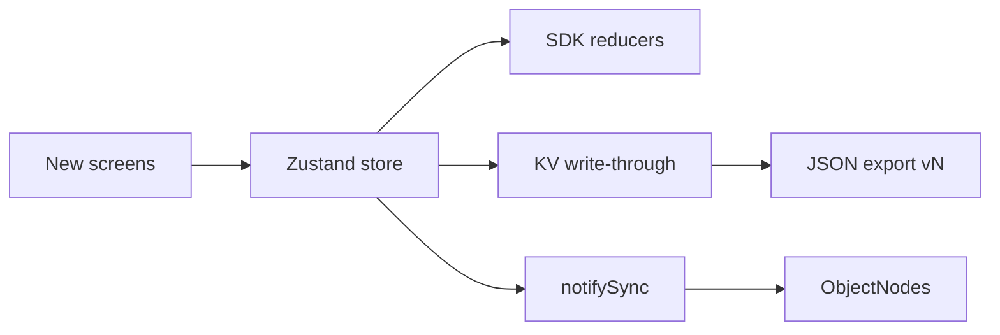
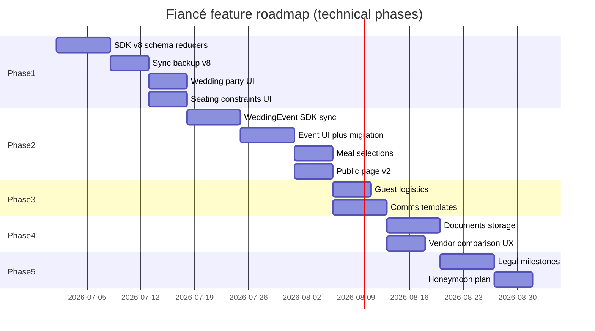

# Fiancé — Plan to close the 10 wedding-planning gaps

## Guiding principles

1. **SDK-first** — schema, reducers, and backup logic live in `packages/fiance-sdk/`; the app wires stores + screens.
2. **One entity = one backup array + one KV key + one `FIANCE_TYPES` entry** when the data has its own lifecycle, FKs, or CRUD screens. Use **JSON string fields** only for blobs that are always edited with their parent (like `faq`, `customFields`).
3. **Backward-compatible backups** — each release bumps `BACKUP_VERSION`; old imports default missing collections to `[]`.
4. **French-first UI** — all labels in `i18n/locales/fr/` first, then `en/`.
5. **Offline-first files** — documents use local URIs (Expo FileSystem / web blob URLs); sync encrypts metadata + optional blob refs, not raw PDFs in ObjectNodes unless size-bounded.
6. **Public page stays minimal** — only expose what guests need; most new data stays private unless explicitly marked public.

---

## Architecture baseline (what every feature touches)

For each new collection, follow the **Communications (v7)** pipeline:

| Layer | Files |
|-------|-------|
| Schema | `packages/fiance-sdk/src/domain/schema.ts` |
| Reducers | `packages/fiance-sdk/src/domain/<entity>.ts` |
| Store | `apps/mobile/store/useXStore.ts` |
| Persistence | `apps/mobile/lib/persistence.ts` (hydrate, persist, clear, restore) |
| Backup | `packages/fiance-sdk/src/sync/backup.ts` + `apps/mobile/lib/sync.ts` |
| Space sync | `FIANCE_TYPES` in `object-types.ts`, mappers in `mappers.ts`, `buildAllNodes` / `hydrateFromSpace` in `space-sync.ts` |
| Legacy import | `import-legacy.ts` |
| Tests | SDK unit tests + `apps/mobile/__tests__/space-sync.test.ts` + sample fixtures |
| Samples | `apps/mobile/samples/shared.ts` |



---

## Release phasing overview

| Phase | Theme | Features | Backup bump |
|-------|-------|----------|-------------|
| **0** | Foundation | Shared patterns, enums, navigation | — |
| **1** | People & seating | #1 Roles, #2 Seating constraints | **v8** |
| **2** | Event structure | #3 Multi-venue/day, #9 Menu choices | **v9** |
| **3** | Logistics & comms | #4 Guest logistics, #7 Comms content | **v10** |
| **4** | Vendors & docs | #5 Documents, #6 Vendor comparison | **v11** |
| **5** | Admin & after | #8 Legal admin, #10 Honeymoon | **v12** |

Phases are ordered by **dependency** and **user value density**. Each phase is shippable on its own.

---

## Phase 0 — Foundation (1 sprint prep)

**Goal:** Unblock parallel work; no user-visible features yet.

### 0.1 Shared types & enums (`packages/fiance-sdk/src/domain/types.ts`)

Add enums used across features:

```typescript
GuestRole = "OFFICIANT" | "WITNESS" | "BRIDESMAID" | "GROOMSMAN" | "RING_BEARER" | "FLOWER_GIRL" | "USHER" | "OTHER"
SeatingConstraintType = "MUST_SIT_TOGETHER" | "MUST_NOT_SIT_TOGETHER"
WeddingEventType = "CIVIL" | "RELIGIOUS" | "LAIC" | "COCKTAIL" | "DINNER" | "BRUNCH" | "OTHER"
CommunicationChannel = "EMAIL" | "POSTAL" | "SMS" | "WHATSAPP" | "OTHER"
DocumentOwnerType = "WEDDING" | "VENDOR" | "GUEST" | "LEGAL" | "HONEYMOON"
LegalMilestoneType = "PUBLICATION_BANS" | "CIVIL_APPOINTMENT" | "CONTRACT_SIGNING" | "DOCUMENTS_DEADLINE" | "CUSTOM"
MealChoice = "STANDARD" | "VEGETARIAN" | "VEGAN" | "CHILD" | "CUSTOM"
```

### 0.2 Feature flags (optional)

`useSettingsStore` or wedding-level JSON `featureFlags` — only if you want gradual rollout; otherwise ship features directly.

### 0.3 Navigation scaffolding

Extend guest tab overflow menu (`guests/_layout.tsx`) and settings index with placeholder routes so later PRs don't fight routing.

### 0.4 Seating validation helper (SDK)

Pure function `validateSeatingPlan(guests, tables, constraints)` returning `{ ok, violations[] }` — reused by seating UI and exports.

**Deliverables:** enums, validation utils, route stubs, plan doc in issue tracker.

---

## Phase 1 — Wedding party & seating constraints

### Gap #1 — Wedding party & roles

**Problem:** Couples plan around témoins, demoiselles, officiant laïque — not just "invité côté mariée".

**Model decision:** New collection **`WeddingRoleAssignment`** (not a single `guest.role` field — officiant may not be in guest list).

```typescript
interface WeddingRoleAssignment {
  id: string;
  role: GuestRole;           // enum
  guestId: string | null;    // null = external person
  displayName: string;       // required if guestId null
  phone: string | null;
  email: string | null;
  notes: string | null;
  sortOrder: number | null;
  createdAt: string | null;
  updatedAt: string | null;
}
```

**Why collection:** independent CRUD, sync node, can exist without guest row, sortable for ceremony order.

**UI scope:**

| Screen | Path | Behavior |
|--------|------|----------|
| Wedding party list | `guests/wedding-party.tsx` | Group by role category (cérémonie / cortège / autres) |
| Add/edit role | `guests/wedding-party/[id].tsx` | Pick role → link existing guest OR free-text name |
| Guest detail link | `guests/[id].tsx` | Show assigned role(s) if any |

**Store:** `useWeddingPartyStore` (or extend `useGuestsStore` — prefer separate store for clarity).

**KV key:** `weddingRoleAssignments`  
**FIANCE_TYPES:** `weddingRoleAssignment` (parent: wedding root)  
**Backup v8:** add `weddingRoleAssignments?: unknown[]`

**Cascade:** deleting guest clears `guestId` on assignments (keep row with displayName copied) OR prompt user — recommend **auto-copy name then null guestId**.

**Public page:** optional future — "Officiant: Élodie Martin" in `about` if `isPublic` flag added later (v8 skip).

**Samples:** 2 témoins, 1 officiant, 4 demoiselles on medium/big.

---

### Gap #2 — Seating constraints

**Problem:** Hardest seating problem is "X with Y" / "A not with B" — capacity alone isn't enough.

**Model:**

```typescript
interface SeatingConstraint {
  id: string;
  type: SeatingConstraintType;
  guestIds: string[];        // 2+ for TOGETHER, 2 for NOT_TOGETHER
  label: string | null;      // "Famille Dupont", "Ex-conjoints"
  isHard: boolean | null;    // hard = block export if violated; soft = warning
  createdAt: string | null;
  updatedAt: string | null;
}
```

**UI scope:**

| Screen | Path | Behavior |
|--------|------|----------|
| Constraints list | `guests/seating-constraints.tsx` | CRUD constraints |
| Seating plan integration | `guests/tables.tsx`, `guests/seating.tsx` | Badge/warning when violation; filter "show conflicts" |
| Export gate | PDF/CSV guest export | Warn if hard constraints violated |

**SDK:** `validateSeatingPlan()`, `getConstraintViolations(constraint, guests, tables)`.

**KV key:** `seatingConstraints`  
**FIANCE_TYPES:** `seatingConstraint`  
**Backup v8:** add `seatingConstraints?: unknown[]`

**Guest delete cascade:** remove guestId from all `guestIds` arrays; delete constraint if < 2 guests remain.

**Samples:** 3 constraints on medium (family together, exes apart, children with parents).

---

### Phase 1 engineering checklist

- [ ] Schema + reducers + store + persistence
- [ ] Backup v8 + migration default `[]`
- [ ] Mappers + `buildAllNodes` + `import-legacy`
- [ ] Screens + i18n FR/EN
- [ ] Unit tests: reducers, validation, backup round-trip
- [ ] Update samples + `samples.test.ts`
- [ ] Analytics: `wedding_party_role_added`, `seating_constraint_added`

**Estimated scope:** ~2–3 focused PRs (SDK+backup, sync, UI).

---

## Phase 2 — Multi-venue / multi-day & menu choices

### Gap #3 — Multi-venue / multi-day structure

**Problem:** One `venueName` + one `weddingDate` can't represent mairie samedi 14h + réception samedi 18h + brunch dimanche.

**Model:** New collection **`WeddingEvent`**

```typescript
interface WeddingEvent {
  id: string;
  type: WeddingEventType;
  title: string;              // "Cérémonie civile", "Réception"
  date: string;               // YYYY-MM-DD
  startTime: string | null;   // HH:mm
  endTime: string | null;
  venueName: string | null;
  address: string | null;
  notes: string | null;
  isPrimary: boolean | null;  // drives dashboard countdown if true
  isPublic: boolean | null;   // show on public page timeline
  sortOrder: number | null;
  createdAt: string | null;
  updatedAt: string | null;
}
```

**Link existing entities (additive FKs, v9 migration defaults null):**

| Entity | New field | Purpose |
|--------|-----------|---------|
| `DayOfItem` | `eventId: string \| null` | Tie run-of-show to sub-event |
| `AgendaEvent` | `eventId: string \| null` | RDV traiteur scoped to réception |
| `Vendor` | `eventId: string \| null` | DJ only for soirée |
| `Guest.invitationType` | keep as-is | map types to events in invitation type config later |

**Wedding row:** keep `weddingDate` + `venueName` as **primary** (backward compat). On first v9 hydrate, if no `WeddingEvent` rows, **auto-migrate**:

```typescript
// One synthetic primary event from existing wedding fields
{ type: "DINNER", title: venueName, date: weddingDate, isPrimary: true, isPublic: true }
```

**UI scope:**

| Screen | Path |
|--------|------|
| Events list | `settings/events.tsx` or `planning/events.tsx` |
| Event editor | `planning/event/[id].tsx` |
| Day-of / agenda pickers | dropdown "Événement" on existing forms |
| Dashboard | countdown uses `isPrimary` event date |

**Public page (`PublicWeddingPage`):**

Extend to v2 (or nested optional field):

```typescript
events?: { title, date, time, venueName, address }[]  // isPublic events only
timeline: still from dayOfItems OR merge public events + public day-of
```

Bump `PublicWeddingPage.version` to `2`; keep v1 readers working.

**KV key:** `weddingEvents`  
**FIANCE_TYPES:** `weddingEvent`  
**Backup v9**

**Samples:** small = 1 event; medium = 3 (civil + réception + brunch); big = 4+.

---

### Gap #9 — Menu choices per guest

**Problem:** `diet` covers allergies/regimes; caterers need entrée/plat/dessert counts.

**Model decision:** Extend **`Guest`** (1:1, no new collection):

```typescript
// Add to Guest
mealChoice: string | null;       // MealChoice enum or custom id
mealChoiceNotes: string | null;
mealCourses: string | null;      // JSON: { starter?: string, main?: string, dessert?: string }
```

Alternative: separate `GuestMealSelection` collection if you expect multiple meals per guest (BOTH_DAYS) — **recommended for medium/big weddings:**

```typescript
interface GuestMealSelection {
  id: string;
  guestId: string;
  eventId: string | null;   // links to WeddingEvent (dinner vs brunch)
  mealChoice: string;
  courses: string | null;   // JSON
  notes: string | null;
}
```

**UI:**

- Guest detail → section "Repas" with per-event tabs if `WeddingEvent` exists
- Budget/caterer export: aggregate counts by `mealChoice` + courses
- New export: **"Synthèse menu traiteur"** PDF/CSV (extends existing PDF export)

**Backup v9:** guest field extensions OR `guestMealSelections[]`

**Depends on:** Phase 2 `#3` if using per-event meals.

**Samples:** populate 5–10% vegetarian/child/custom on medium/big.

---

### Phase 2 checklist

- [ ] `WeddingEvent` full pipeline + auto-migration from wedding row
- [ ] FK fields on DayOfItem, AgendaEvent, Vendor
- [ ] Public page v2 + wedding page UI
- [ ] Meal selections (guest fields or collection)
- [ ] Caterer summary export
- [ ] Backup v9, samples, tests

---

## Phase 3 — Guest logistics & communications content

### Gap #4 — Guest logistics beyond hébergement

**Problem:** Shuttle vendor exists but no per-guest assignment; no parking/arrival tracking.

**Model:** Extend **`Guest`** + optional link to **`Vendor`** (shuttle):

```typescript
// Guest additions
shuttleVendorId: string | null;
shuttlePickupLocation: string | null;
shuttlePickupTime: string | null;
parkingNeeded: boolean | null;
parkingNotes: string | null;
arrivalNotes: string | null;   // "Train TGV 14h02"
transportMode: string | null;  // "car" | "train" | "shuttle" | "taxi"
```

**Optional collection `ShuttleRun`** if one bus does multiple pickups:

```typescript
interface ShuttleRun {
  id: string;
  vendorId: string;
  label: string;              // "Navette 18h — Gare"
  departureTime: string;
  pickupLocation: string;
  capacity: number | null;
  guestIds: string[];         // embedded like Communication.recipients
}
```

**Recommendation:** start with **Guest fields only** (MVP); add `ShuttleRun` in v10.1 if needed.

**UI:**

| Screen | Change |
|--------|--------|
| `guests/[id].tsx` | Section "Transport & arrivée" |
| `guests/accommodations.tsx` | Cross-link sleeping guests without shuttle |
| Vendor shuttle detail | "Assigner invités" roster (like communications) |

**Export:** CSV column set for traiteur/navette; PDF guest list extension.

**Backup v10:** guest schema extension (no new collection in MVP).

**Samples:** 20% guests with shuttle on medium/big.

---

### Gap #7 — Communications content

**Problem:** You track *who* got the save-the-date, not *what* was sent.

**Model:** Extend **`Communication`**:

```typescript
interface Communication {
  // existing...
  channel: string | null;           // CommunicationChannel
  subject: string | null;
  body: string | null;              // plain text or markdown
  templateId: string | null;        // optional FK
}
```

**Optional collection `CommunicationTemplate`** (recommended):

```typescript
interface CommunicationTemplate {
  id: string;
  name: string;                     // "Save-the-date email"
  channel: string;
  subject: string | null;
  body: string;                     // with {{guest.firstName}} placeholders
  isSystem: boolean | null;
  createdAt: string | null;
  updatedAt: string | null;
}
```

**SDK:** `renderTemplate(template, guest, wedding)` for preview/copy.

**UI:**

| Screen | Behavior |
|--------|----------|
| `communications.tsx` | Show channel + subject snippet |
| `communication/[id].tsx` | Template picker, preview, "Copy to clipboard" |
| New `communications/templates.tsx` | CRUD templates |
| Guest roster | Unchanged; add "Preview message" per guest |

**Backup v10:** extend Communication shape (backward compatible nulls) + `communicationTemplates[]`.

**Default templates:** seed 3 system templates on first hydrate (like invitation types).

**Samples:** fill subject/body on all sample communications.

---

### Phase 3 checklist

- [ ] Guest logistics fields + UI + exports
- [ ] Communication content fields + templates collection
- [ ] Template renderer in SDK
- [ ] Backup v10, i18n, samples, tests

---

## Phase 4 — Documents & vendor comparison

### Gap #5 — Documents & contracts

**Problem:** Devis PDFs live outside the app.

**Model:** New collection **`Document`**

```typescript
interface Document {
  id: string;
  ownerType: DocumentOwnerType;
  ownerId: string | null;         // vendorId, guestId, legalMilestoneId, etc.
  label: string;
  fileName: string;
  mimeType: string | null;
  localUri: string;                 // device path or web blob ref
  fileSize: number | null;
  uploadedAt: string | null;
  notes: string | null;
  createdAt: string | null;
  updatedAt: string | null;
}
```

**Storage strategy:**

| Platform | Approach |
|----------|----------|
| Native | Copy picked file to `FileSystem.documentDirectory/wedding-docs/{id}` |
| Web | IndexedDB blob store keyed by doc id (mirror pattern from KV) |
| Sync | Sync **metadata only** in ObjectNode; blobs stay local unless Premium cloud docs (future) |

**UI:**

| Screen | Path |
|--------|------|
| Vendor detail | Tab "Documents" on `vendors/[type]/[id].tsx` |
| Legal hub | `settings/documents.tsx` (all docs filterable) |
| Wedding settings | Link "Documents" |

**Dependencies:** `expo-document-picker`, `expo-file-system` (already in stack).

**Backup v11:** export `documents[]` with **localUri stripped or marked** — on import, show "fichier non inclus, re-attacher" (same pattern as idea images).

**Security:** documents never on public page; never in unencrypted invite nodes.

**Samples:** 1–2 metadata-only doc records (no binary).

---

### Gap #6 — Vendor comparison

**Problem:** One vendor row per type in practice; couples compare 3 caterers.

**Model:** Extend **`Vendor`** (minimal):

```typescript
comparisonGroupId: string | null;  // same UUID = same slot
isSelected: boolean | null;        // winner for budget roll-up
sortOrder: number | null;          // within group
```

**Alternative:** `VendorComparisonGroup` collection — only if you need group-level notes ("Décision avant 15 mars").

**UI (mostly UX, not new entity):**

| Screen | Enhancement |
|--------|-------------|
| `vendors/compare.tsx` | Generalize beyond caterers; pick group or type |
| `vendors/[type]/index.tsx` | "Comparer les devis" when 2+ vendors |
| Vendor detail | Toggle "Retenu" / "Écarté"; badge on list |
| Budget | Only `isSelected` vendors count toward committed spend (toggle in settings) |

**Budget SDK:** `computeBudgetSummary()` respects `isSelected !== false` filter.

**Backup v11:** vendor field extensions (nullable, no migration needed).

**Samples:** 2 caterer prospects + 1 selected on medium; 3 photographers on big.

---

### Phase 4 checklist

- [ ] Document collection + file I/O layer (`lib/documents.ts`)
- [ ] Vendor comparison fields + compare UI overhaul
- [ ] Budget integration for selected vendor
- [ ] Backup v11 (documents array + vendor fields)
- [ ] Tests for file pick mock + backup strip localUri

---

## Phase 5 — Legal admin & honeymoon

### Gap #8 — Legal / administrative first-class data

**Problem:** Mairie, publications, contrat — buried in generic tasks.

**Model:** New collection **`LegalMilestone`**

```typescript
interface LegalMilestone {
  id: string;
  type: LegalMilestoneType;
  title: string;
  dueDate: string | null;
  completedDate: string | null;
  status: string | null;          // TODO | DONE | NA
  location: string | null;        // "Mairie du 11e"
  notes: string | null;
  documentIds: string[] | null;   // JSON string[] or FK to Document
  reminderDaysBefore: number | null;
  createdAt: string | null;
  updatedAt: string | null;
}
```

**Seed on first wedding:** FR defaults — publications, RDV mairie, dossier documents, signature contrat.

**UI:**

| Screen | Path |
|--------|------|
| Legal checklist | `planning/legal.tsx` or settings |
| Milestone editor | `planning/legal/[id].tsx` |
| Dashboard | Widget "Administratif" with next deadline |
| Planning tab | Optional 4th aspect: `legal` alongside preparation/agenda/day-of |

**Task linking:** optional `legalMilestoneId` on Task OR auto-generate tasks from milestones (one-way sync on create).

**Backup v12:** `legalMilestones[]`

**Samples:** 4 milestones, 2 done, on all sizes.

---

### Gap #10 — Honeymoon

**Problem:** Task category "lune de miel" exists; no destination/budget/itinerary entity.

**Model:** **`HoneymoonPlan`** — singleton per wedding (collection of 0–1 row, or JSON on wedding).

**Recommended:** collection with max 1 row (easier sync than wedding JSON blob):

```typescript
interface HoneymoonPlan {
  id: string;
  destination: string | null;
  startDate: string | null;
  endDate: string | null;
  budgetTarget: number | null;
  spentAmount: number | null;
  notes: string | null;
  itinerary: string | null;       // JSON: { day, activity, bookingRef }[]
  createdAt: string | null;
  updatedAt: string | null;
}
```

**UI:**

| Screen | Path |
|--------|------|
| Honeymoon hub | `planning/honeymoon.tsx` |
| Link from home | Card after wedding date passed OR always in planning overflow |

**Budget:** optional separate category `honeymoon` in `categoryBudgets` OR use plan's `budgetTarget`.

**Public page:** never exposed.

**Backup v12:** `honeymoonPlans[]` (0–1 enforced in reducer)

**Samples:** plan on medium/big (Toscane, 7 nights, €3500).

---

### Phase 5 checklist

- [ ] LegalMilestone pipeline + FR seed templates
- [ ] HoneymoonPlan pipeline
- [ ] Dashboard widgets
- [ ] Document linking from legal milestones
- [ ] Backup v12, samples, tests

---

## Cross-cutting work (all phases)

### Backup version roadmap

| Version | Additions |
|---------|-----------|
| v8 | `weddingRoleAssignments`, `seatingConstraints` |
| v9 | `weddingEvents`, `guestMealSelections` (or guest meal fields), FK fields |
| v10 | Guest logistics fields, `communicationTemplates`, Communication extensions |
| v11 | `documents`, Vendor comparison fields |
| v12 | `legalMilestones`, `honeymoonPlans` |

Each bump: update `BACKUP_VERSION`, `WeddingSnapshot`, `restoreFromBackup` defaults, `samples/shared.ts`, `parseAndRestore` tests.

### Public page evolution

| Version | New guest-visible data |
|---------|------------------------|
| v1 (current) | about, timeline, faq, gifts |
| v2 | public `WeddingEvent`s, richer timeline |
| Future | dress code field, shuttle info for logged-in guest (RSVP portal) |

### Export / PDF / CSV matrix (new outputs)

| Export | Phase |
|--------|-------|
| Seating plan + constraint report | 1 |
| Menu summary for caterer | 2 |
| Guest logistics (shuttle/parking) | 3 |
| Vendor comparison sheet | 4 |
| Legal checklist PDF | 5 |

### Analytics events (add to `analytics.ts`)

`wedding_role_assigned`, `seating_constraint_created`, `wedding_event_created`, `meal_choice_set`, `guest_logistics_updated`, `communication_template_used`, `document_attached`, `vendor_selected_for_budget`, `legal_milestone_completed`, `honeymoon_plan_created`.

### i18n namespaces

Most strings in existing `guests`, `planning`, `vendors`, `settings`; add:

- `guests:weddingParty.*`
- `guests:seatingConstraints.*`
- `planning:events.*`, `planning:legal.*`, `planning:honeymoon.*`
- `vendors:documents.*`, `vendors:comparison.*`
- `communications:templates.*`

### Sample data updates

After each phase, extend `apps/mobile/samples/shared.ts` so small/medium/big demonstrate the new feature at appropriate depth.

---

## Suggested PR breakdown (18–22 PRs total)



---

## Risk register

| Risk | Mitigation |
|------|------------|
| Backup version fragmentation | One version bump per phase; never partial schema in production |
| Document blob size / sync | Metadata-only sync; explicit "local only" UX |
| Seating constraint solver complexity | Warnings only in v1; no auto-solver |
| Multi-event UX overload | Sensible defaults + auto-migration from single wedding row |
| Public page breaking guests | Version field + backward-compatible readers |
| SDK/app drift | All reducers in SDK; app stores stay thin wrappers |

---

## Definition of done (per feature)

1. Schema + SDK reducers with unit tests  
2. Store + persistence + backup round-trip test  
3. Space sync + import-legacy covered  
4. FR + EN UI  
5. Sample weddings updated  
6. `pnpm test` + `pnpm --filter fiance build:web` green  
7. No regression on RSVP, budget compute, public page v1  

---

## Recommended starting point

**Phase 1 (#1 + #2)** delivers the highest pain relief for real couples (people + seating) with clean new collections and a single backup bump to v8. It doesn't depend on documents, events, or public page changes.

Start with **Phase 1 PR 1: SDK schema + reducers + backup v8**, then land UI in follow-up PRs.
